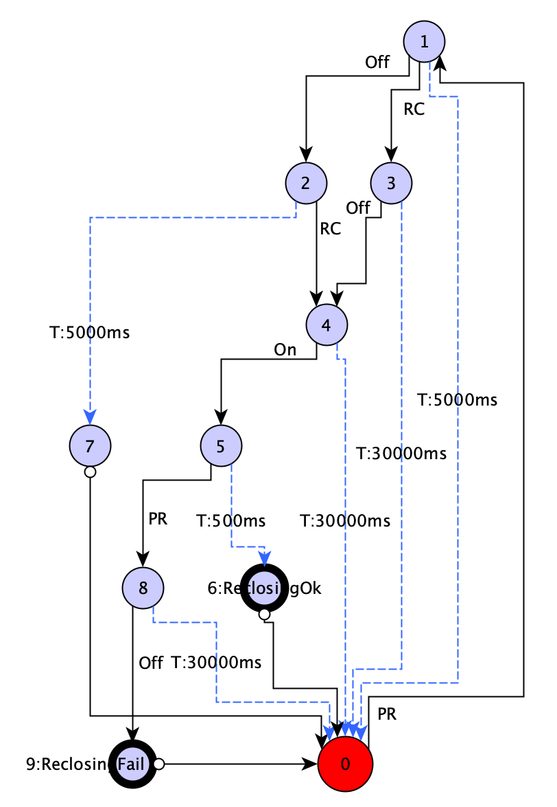

# FLISR

FLISR - Fault Location, Isolation, and Service Restoration service can automate power restoration in seconds,
automatically isolating faults and restoring power to disconnected feeders.
The FLISR operation logic is described by the following algorithm and consists of four steps:
1. Determination of failed auto reclosing event
2. Determination of a faulty section of the network
3. Creation of a list of circuit breakers to isolate a faulty section of the network
4. Formation of a list of circuit breakers to restore power supply to isolated sections of the power grid
## Determination of failed auto reclosing event
The state machine diagram describes how the result of the auto-reclosing process is determined.

```
On  - The switch turns on
Off - The switch turns off
PR  - Overcurrent protection alarm
RC  - Automatic reclosing in progress
T   - Go to next state by timeout
```
## Determination of a faulty section of the network
1. FLISR generates a list of received signals about exceeding the permissible current (over-current alarms)
2. FLISR generates a list of relevant switching devices
3. FLISR sorts the list of switching devices by topology distance from power supplies
4. The farthest terminal of the farthest switching device from the power centre is determined
5. The section of the grid connected to the found terminal is determined
6. This grid section is designated as faulty
## Creation of a list of circuit breakers to isolate a faulty section of the network
7. A list of switching devices connected directly to the emergency section is formed. These switching devices will need to be switched off to isolate the emergency section.
8. FLISR publishes a message with a list of switching devices to turn off
9. FLISR turns off the selected switching devices in its internal network model
## Formation of a list of circuit breakers to restore power supply to isolated sections of the power grid
10. A new electrical state of the network sections is calculated based on the internal model
11. A list of network sections that are isolated is formed
12. For each of the sections of the network that are without voltage, except for the section designated as faulty, a list of switching devices is formed, located between the selected section of the network and each of the power centres
13. Each of the generated lists of switching devices is checked, and if this list contains switching devices that were defined in paragraph 7, then this list is excluded from further consideration.
14. The remaining lists of switching devices for restoration of power supply are displayed for selection by the dispatcher.
15. The new topology of the circuit is checked and a list of switching devices is formed for which it is necessary to change the number of the setting group


## Configuration 
All FLISR configuration is stored in .ini file.
```ini
[FLISR]
; Logging level: ERROR, WARN, INFO, DEBUG
LOG = DEBUG

; Path to state machine configuration
STATE_MACHINE_CONFIG = state_machine.yml

; Length of internal queue
QUEUE = 100

; FLISR state RTDB point identifier from POINT table
RTDB_POINT_FLISR_STATE = 2887

; FLISR point source from POINT_SOURCE table
POINT_SOURCE = 15
```
